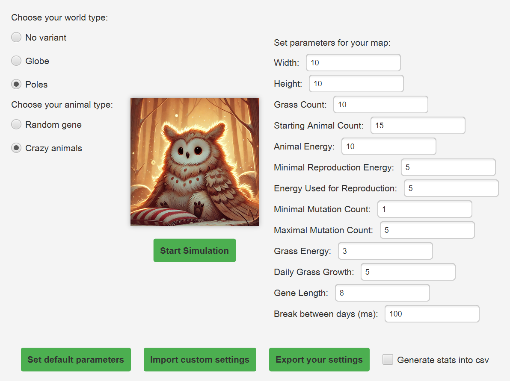
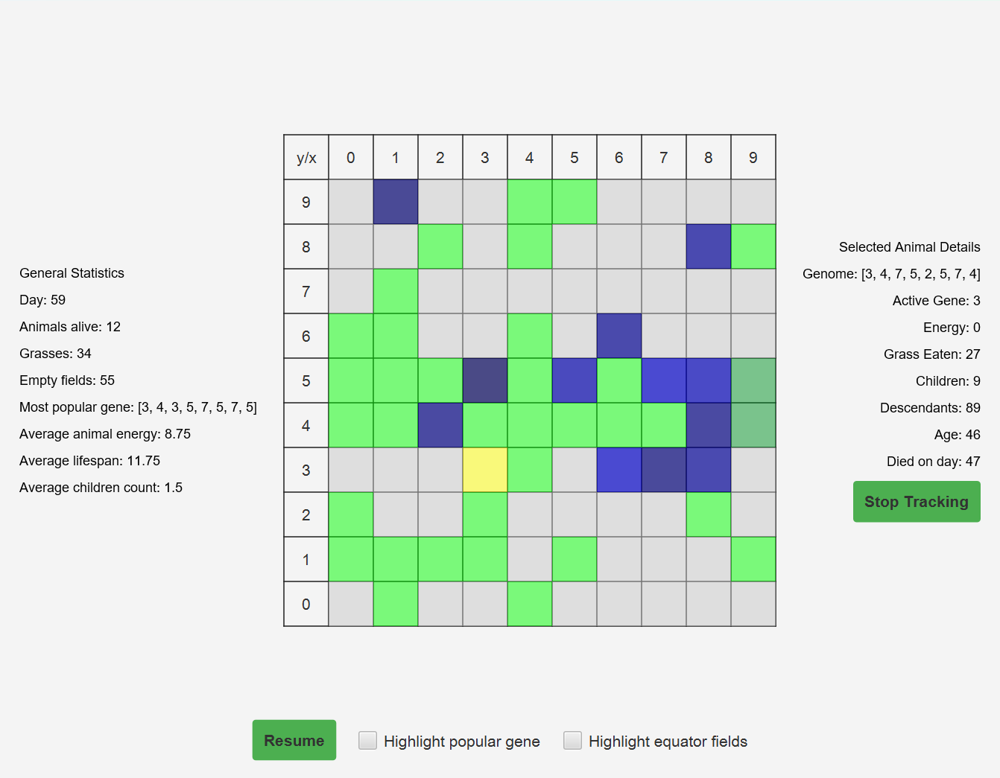

#  Darwin World

##  Project Description
Darwin World is a Java-based application that simulates an ecosystem where animals live, move, eat, and reproduce according to configurable evolutionary rules. Developed during the 3rd semester of Computer Science at **AGH UST** in Kraków.

##  Key Functionalities
*   **Real-time Visualization:** Observe the ecosystem's dynamics on an interactive map powered by **JavaFX**.
*   **Flexible Configuration:** 
    *   Customize map size, animal energy, plant growth rates, and more.
    *   **Import/Export** simulation settings via **CSV** files.
*   **Data Analytics:**
    *   Track live population statistics for the entire simulation.
    *   **Animal Tracking:** Select a specific individual to monitor its genome, energy levels, and descendants.
*   **Concurrent Simulations:** Run and observe multiple independent worlds simultaneously in separate windows.
*   **Rule Variants:** Support for different map topologies and animal behavior modes.

##  Tech Stack
*   **Language:** Java 21
*   **GUI Framework:** JavaFX
*   **Build Tool:** Gradle

##  More Information

The original project requirements and detailed simulation mechanics (in Polish) can be found [here](https://github.com/Soamid/obiektowe-lab/tree/master/proj).

##  Authors

  * **Mekost** – [GitHub Profile](https://github.com/Mekost)
  * **stawkey** – [GitHub Profile](https://github.com/stawkey)

